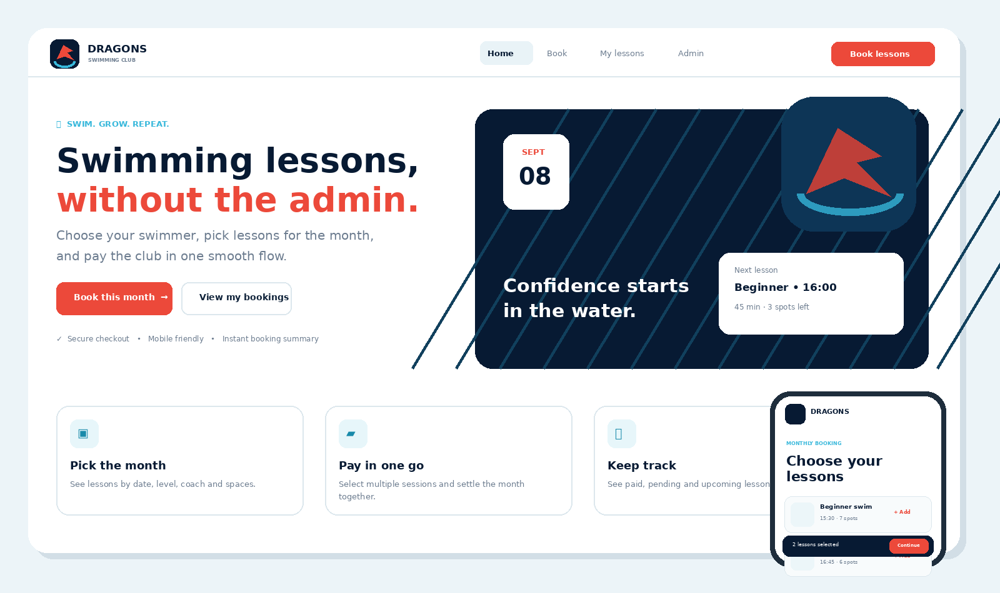

# 🐉 Dragons Swimming Club — Booking & Payments Platform

A modern, mobile-first swimming lesson booking platform built for **Dragons Swimming Club**.

The application allows parents and swimmers to browse available lessons, book multiple sessions for the month, complete checkout, manage bookings, and gives the swimming school an admin dashboard for lessons, bookings, capacity, and revenue.

> Built as a full-stack portfolio project using **FastAPI, SQLite, JavaScript, HTML, CSS, and Payfast-ready payment architecture**.

---

<h2 align="center">📸 App Preview</h2>

<p align="center">
  
</p>

---

## ✨ Project Overview

Swimming schools often manage bookings through WhatsApp messages, spreadsheets, EFT confirmations, and manual attendance lists.

This project brings those workflows into one simple system.

### For parents and swimmers

- Browse available swimming lessons
- Filter lessons by swimming level
- View lesson date, time, coach, price, and capacity
- Select multiple lessons for the month
- Add swimmer information
- Checkout in one booking flow
- Pay through a structured payment workflow
- View booking status and previous lessons

### For Dragons Swimming Club

- View total bookings
- Track paid revenue
- Monitor lesson capacity
- See upcoming swimming lessons
- View recent bookings
- Add new lessons
- Manage available places per class

---

# 🚀 Key Features

## 📅 Monthly Lesson Booking

Parents can select multiple lessons from the monthly timetable instead of booking every lesson individually.

Each lesson contains information such as:

- Date
- Time
- Swimming level
- Coach
- Price
- Maximum class size
- Remaining spaces

---

## 🏊 Swimmer Profiles

The checkout process captures swimmer information separately from the parent or guardian details.

This structure allows the platform to later support:

- Multiple children per parent
- Swimming levels
- Attendance history
- Progress tracking
- Coach notes
- Certificates

---

## 💳 Payment Architecture

The project includes a payment layer designed for:

- Demo payments
- Payfast Sandbox testing
- Future Payfast production payments

The default repository configuration uses:

```env
PAYMENT_MODE=demo
```

This allows the full booking → checkout → payment → confirmation flow to be demonstrated without real money.

### Payment modes

```text
demo
sandbox
live
```

Production merchant credentials must be stored in `.env` and must **never** be committed to GitHub.

---

## 📊 Admin Dashboard

The administration interface gives the swimming school an overview of the business.

Example metrics include:

```text
Total Bookings
Paid Revenue
Reserved Seats
Upcoming Lessons
Recent Bookings
Class Capacity
```

Admins can also create new swimming lessons directly through the dashboard.

---

# 📱 Mobile-First Design

The interface was designed primarily for parents booking from their phones.

The app includes:

- Responsive layouts
- Mobile bottom navigation
- Large touch-friendly controls
- Simple lesson cards
- Clear booking states
- Fast checkout flow
- Desktop support

The goal is to reduce the number of steps required to book swimming lessons.

---

# 🧠 Architecture

```text
                         DRAGONS SWIMMING CLUB
                                  │
                                  ▼
                    ┌──────────────────────────┐
                    │      Frontend UI         │
                    │ HTML + CSS + JavaScript  │
                    └─────────────┬────────────┘
                                  │
                                  ▼
                    ┌──────────────────────────┐
                    │       FastAPI API        │
                    │  Validation + Routing    │
                    └─────────────┬────────────┘
                                  │
              ┌───────────────────┼───────────────────┐
              ▼                   ▼                   ▼
       ┌─────────────┐     ┌─────────────┐     ┌─────────────┐
       │   Lessons   │     │  Bookings   │     │  Payments   │
       │   Service   │     │   Service   │     │   Service   │
       └──────┬──────┘     └──────┬──────┘     └──────┬──────┘
              │                   │                   │
              └───────────────────┼───────────────────┘
                                  ▼
                         ┌────────────────┐
                         │     SQLite     │
                         │    Database    │
                         └────────────────┘
```

---

# 🛠 Technology Stack

| Layer | Technology |
|---|---|
| Backend | Python |
| API Framework | FastAPI |
| Validation | Pydantic |
| Database | SQLite |
| Frontend | HTML5 |
| Styling | CSS3 |
| Client Logic | Vanilla JavaScript |
| Web Server | Uvicorn |
| Payments | Demo / Payfast-ready |
| Testing | Pytest |
| CI/CD | GitHub Actions |
| Configuration | python-dotenv |

---

# 📂 Project Structure

```text
dragons-swim-booking/
│
├── .github/
│   └── workflows/
│       └── ci.yml
│
├── app/
│   ├── __init__.py
│   ├── config.py
│   ├── db.py
│   ├── main.py
│   ├── models.py
│   └── payfast.py
│
├── docs/
│   └── dragons-app-preview.png
│
├── static/
│   ├── index.html
│   ├── app.js
│   ├── styles.css
│   ├── dragon-mark.svg
│   └── manifest.webmanifest
│
├── tests/
│   └── test_core.py
│
├── .env.example
├── .gitignore
├── LICENSE
├── README.md
├── requirements.txt
└── requirements-dev.txt
```

---

# ⚡ Getting Started

## 1. Clone the repository

```bash
git clone https://github.com/YOUR_USERNAME/dragons-swim-booking.git
cd dragons-swim-booking
```

---

## 2. Create a virtual environment

### Windows PowerShell

```powershell
py -3.12 -m venv .venv
.venv\Scripts\Activate.ps1
```

### macOS / Linux

```bash
python3 -m venv .venv
source .venv/bin/activate
```

---

## 3. Install dependencies

```bash
pip install -r requirements.txt
```

For development and testing:

```bash
pip install -r requirements-dev.txt
```

---

## 4. Configure the application

Copy the example environment file.

### Windows

```powershell
Copy-Item .env.example .env
```

### macOS / Linux

```bash
cp .env.example .env
```

The default development configuration can use:

```env
PAYMENT_MODE=demo
ADMIN_KEY=change-this-before-deploying
```

Do not commit your real `.env` file.

---

## 5. Start the server

```bash
uvicorn app.main:app --reload
```

Open:

```text
http://localhost:8000
```

---

# 🧪 Demo Booking Flow

A typical customer journey is:

```text
Open Dragons
      │
      ▼
Browse Lessons
      │
      ▼
Choose Swimming Level
      │
      ▼
Select Monthly Lessons
      │
      ▼
Enter Parent Details
      │
      ▼
Enter Swimmer Details
      │
      ▼
Review Booking
      │
      ▼
Checkout
      │
      ▼
Demo / Payfast Payment
      │
      ▼
Booking Confirmation
      │
      ▼
View My Lessons
```

---

# 🔐 Admin Dashboard

Open:

```text
http://localhost:8000/#/admin
```

Enter the admin key configured in your `.env`.

For local development the example configuration contains:

```env
ADMIN_KEY=change-this-before-deploying
```

Change this before deploying the application anywhere public.

---

# 💰 Payfast Configuration

The application was structured so the demo payment provider can later be replaced by a Payfast Sandbox or Live configuration.

Example:

```env
PAYMENT_MODE=sandbox

PAYFAST_MERCHANT_ID=
PAYFAST_MERCHANT_KEY=
PAYFAST_PASSPHRASE=
```

When production merchant details have been configured and tested:

```env
PAYMENT_MODE=live
```

### Important

Never place real payment credentials directly inside Python, JavaScript, HTML, or the GitHub repository.

Use environment variables.

---

# 🛡 Security Decisions

This project follows several important application security principles.

### Server-side pricing

The browser does not decide the final amount charged.

Lesson prices are retrieved and calculated on the backend to reduce price manipulation.

### Capacity validation

Lesson availability is verified when creating the booking.

This prevents the frontend alone from deciding whether spaces are available.

### Environment variables

Sensitive values are stored outside source control.

```text
.env
```

is excluded through `.gitignore`.

### Payment verification

Production payment implementations should validate payment notifications before marking a booking as paid.

### Admin protection

The current admin key implementation is appropriate for demonstrating the MVP architecture.

A production system should replace this with authenticated staff accounts and role-based access control.

---

# 🧪 Running Tests

Run:

```bash
pytest
```

The automated tests cover important application behaviour such as:

- Booking creation
- Lesson totals
- Capacity reservation
- Payment signing logic
- Core API behaviour

---

# ⚙️ GitHub Actions

The project contains a GitHub Actions workflow so automated checks can run whenever changes are pushed or a pull request is opened.

This helps prevent broken code from being merged into the main branch.

---

# 🌍 Production Roadmap

The current application is designed as a strong MVP and portfolio project.

Before operating it as a production swimming-school platform, the next development stages would include:

### Phase 1 — Authentication

- Parent accounts
- Secure login
- Password reset
- Staff accounts
- Role-based permissions

### Phase 2 — Family Management

- Multiple swimmers per parent
- Saved swimmer profiles
- Emergency contacts
- Medical / safety notes
- Swimming levels

### Phase 3 — Full Payments

- Payfast Sandbox validation
- Live merchant account
- Payment receipts
- Failed payment handling
- Refund workflows
- Outstanding balance tracking

### Phase 4 — Swimming Operations

- Attendance
- Coach registers
- Progress tracking
- Level advancement
- Coach notes
- Certificates
- Make-up lessons

### Phase 5 — Communication

- Email booking confirmations
- WhatsApp reminders
- Lesson cancellation alerts
- Payment reminders
- Monthly schedules

### Phase 6 — Infrastructure

- PostgreSQL
- Cloud deployment
- HTTPS
- Automated backups
- Monitoring
- Error reporting
- Rate limiting

---

# 💡 Future AI Features

A future version could introduce AI-powered functionality such as:

- Automatic lesson recommendations
- Parent support chatbot
- Coach schedule optimisation
- Attendance pattern analysis
- Swimmer progress summaries
- Automated WhatsApp responses
- Intelligent waiting lists
- Demand forecasting

---

# 🎯 Why I Built This Project

This project demonstrates more than frontend design.

It shows an end-to-end approach to building software around a real business workflow:

```text
Business Problem
       ↓
User Experience
       ↓
Booking Workflow
       ↓
Backend API
       ↓
Database
       ↓
Payment Architecture
       ↓
Administration
       ↓
Testing
       ↓
Deployment Strategy
```

The goal was to turn a process that could otherwise depend on WhatsApp messages, spreadsheets, and manual payment tracking into one structured platform.

---

# 🧑‍💻 Engineering Concepts Demonstrated

This repository demonstrates:

- REST API design
- Backend validation
- Database modelling
- Responsive frontend development
- Payment integration architecture
- Environment configuration
- Separation of concerns
- Server-side business rules
- CRUD operations
- Automated testing
- CI workflows
- Security-conscious development
- Product-focused software engineering

---

# 📈 Potential Business Impact

A production version of the platform could help a swimming school:

- Reduce booking administration
- Reduce back-and-forth WhatsApp messages
- Improve payment visibility
- Prevent overbooked lessons
- Give parents a simpler experience
- Provide one source of truth for bookings
- Improve monthly planning
- Track capacity and revenue more easily

---

# 🗺️ Product Vision

```text
                    DRAGONS PLATFORM

        ┌─────────────────────────────────┐
        │          Parent Portal          │
        ├─────────────────────────────────┤
        │ Booking │ Payments │ Progress   │
        └────────────────┬────────────────┘
                         │
                         ▼
        ┌─────────────────────────────────┐
        │       Dragons Operations        │
        ├─────────────────────────────────┤
        │ Lessons │ Coaches │ Attendance  │
        └────────────────┬────────────────┘
                         │
                         ▼
        ┌─────────────────────────────────┐
        │        Business Insights        │
        ├─────────────────────────────────┤
        │ Revenue │ Capacity │ Demand     │
        └─────────────────────────────────┘
```

---

# 📸 Screenshots

## Main Booking Experience

<p align="center">
  
</p>

---

# 🤝 Contributing

This project is currently maintained as a portfolio and product-development project.

Suggestions, issues, and pull requests are welcome.

For major changes, open an issue first describing the feature or improvement.

---

# 📄 License

This project is licensed under the MIT License.

See:

```text
LICENSE
```

for details.

---

# 👨‍💻 Author

**Suhail Gamieldien**

BCom IT & Management Sciences student focused on:

- Artificial Intelligence
- Automation
- Full-stack software development
- Business process optimisation
- AI-powered business systems

---

## ⭐ Support the Project

If you find this project useful or interesting, consider giving the repository a ⭐.

---

<p align="center">
  <strong>Dragons Swimming Club</strong><br>
  Simple booking. Better swimming.
</p>
